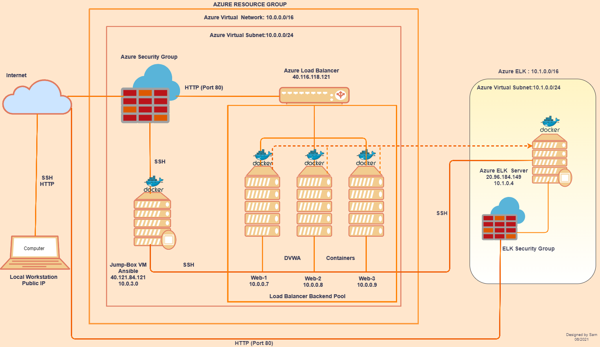
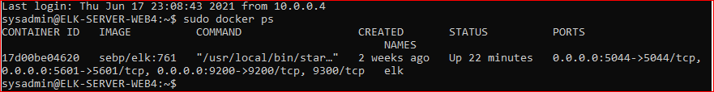
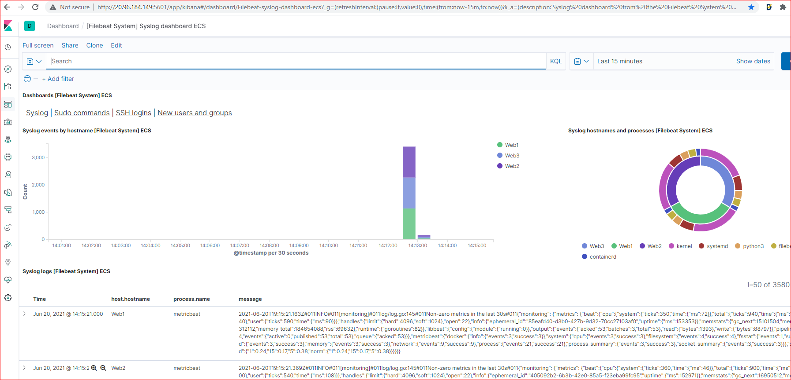
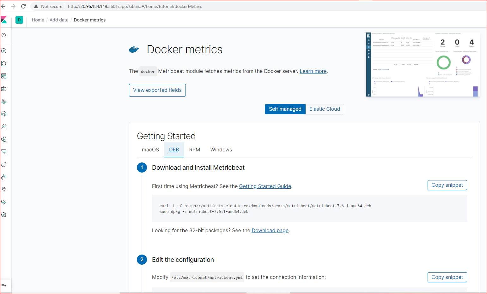
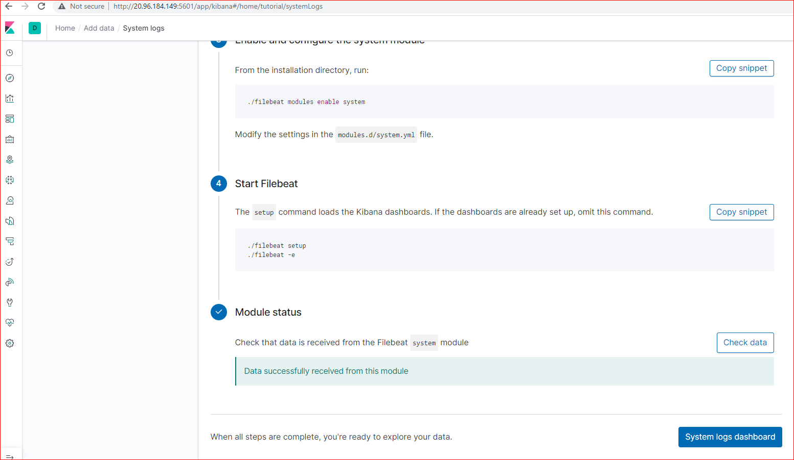
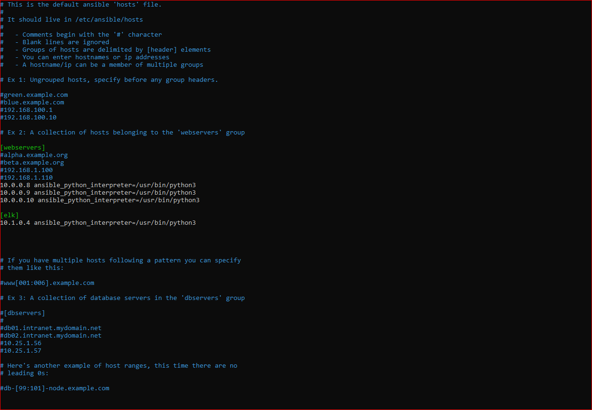
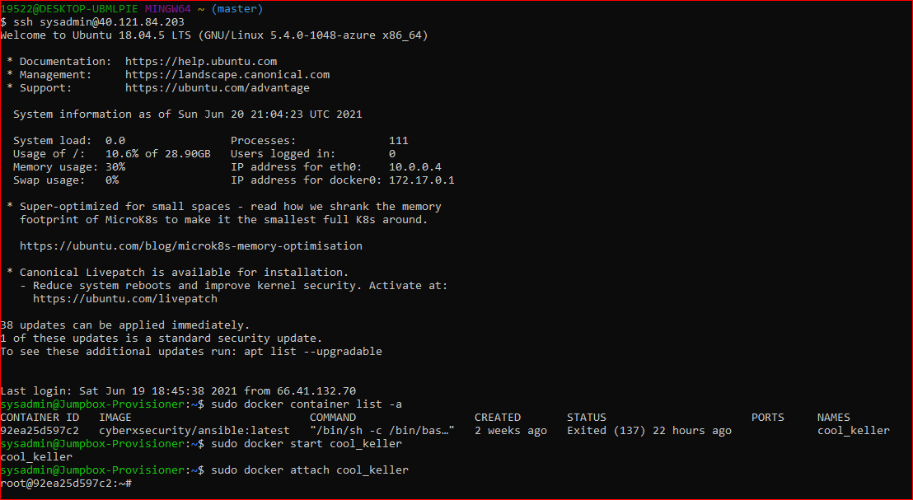
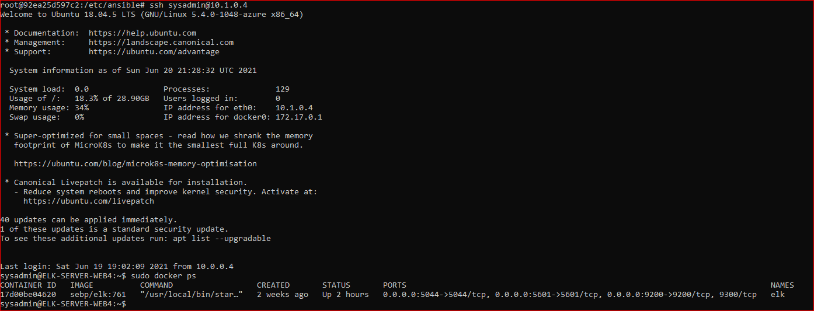
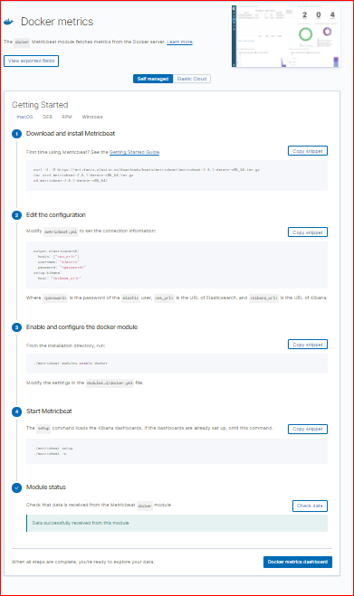

# Automated ELK Stack Deployment

The files in this repository were used to configure the network depicted below.

These files have been tested and used to generate a live ELK deployment on Azure. They can be used to either recreate the entire deployment pictured above. Alternatively, select portions of the playbook.yml files may be used to install only certain pieces of it, such as Filebeat.

[DVWA-playbook.yml for web servers install](./DVWA/DVWA-playbook.yml)
[ELK-Playbook for ELK server install](./ELK/elk-playbook.yml)
[Filebeat for sevice to web servers](./Filebeat/filebeat-playbook.yml)
[Metricbeat for service to web servers](./Metricbeat/metricbeat-playbook.yml)

This document contains the following details:

- Description of the Topology- Access Policies
- ELK Configuration
  - Beats in Use
  - Machines Being Monitored
- How to Use the Ansible Build

## Description of the Topology

The main purpose of this network is to expose a load-balanced and monitored instance of DVWA, the D*mn Vulnerable Web Application.

Load balancing ensures that the application will be highly available, in addition to restricting access to the network.

- What aspect of security do load balancers protect? What is the advantage of a jump box?
Load balancers protect the servers from becoming overloaded with traffic, hence it balances traffic between servers for high availability. Load balancers conduct continuous health checks on servers to ensure they can handle requests.

The Jump-box acts as a secure adminstration workstation and connects through ssh to web VMs when perfoming administration tasks.

Integrating an ELK server allows users to easily monitor the vulnerable VMs for changes to the logs and system traffic.

- What does Filebeat watch for?
Filebeat monitors the log files or locations specified, collects log events, and forwards them either to Elasticsearch or Logstash for indexing.

- What does Metricbeat record?
Metricbeat records metric and statistical data from the operating system and from services running on the server.

The configuration details of each machine may be found below.
_Note: Use the [Markdown Table Generator](http://www.tablesgenerator.com/markdown_tables) to add/remove values from the table_.

| Name     | Function    | IP Address | Operating System |
|----------|-------------|------------|------------------|
| Jump Box | Gateway     | 10.0.0.1   | Linux            |
| ELK      | ELK-Monitor |  10.1.0.4  | Linux            |
| Web1     | webserver   |  10.0.0.8  | Linux            |
| Web2     | webserver   |  10.0.0.9  | Linux            |
| Web3     | webserver   |  10.0.0.10 | Linux            |

### Access Policies

The machines on the internal network are not exposed to the public Internet.

Only the Jump Box machine can accept connections from the Internet. Access to this machine is only allowed from the following IP addresses: Local/personal ip address.

- Add whitelisted IP addresses. Personal IP address 55.xxx.xxx.72

Machines within the network can only be accessed by ssh from the jumpbox

- Which machine did you allow to access your ELK VM? What was its IP address?
The ELK Server is accessed through SSH form the Jump Box from my personal IP address. 55.xxx.xxx.72

A summary of the access policies in place can be found in the table below.

| Name         | Publicly Accessible | Allowed IP Addresses |
|--------------|---------------------|----------------------|
| Jump Box     | Yes                 | Personal IP          |
|   Web1       | NO                  | 10.0.0.8             |
|   Web2       | NO                  | 10.0.0.9             |
|   Web3       | NO                  | 10.0.0.10            |
| ELK Server   | NO                  | 10.1.0.4             |

### Elk Configuration

Ansible was used to automate configuration of the ELK machine. No configuration was performed manually, which is advantageous because...

- _TODO: What is the main advantage of automating configuration with Ansible?_

The playbook implements the following tasks:

- In 3-5 bullets, explain the steps of the ELK installation play. E.g., install Docker; download image; etc._
- Install docker.io
- Install python3-pip
- Install docker via pip
- Increase vitual memory
- Download and launch a docker elk container - starts docker and establishes  the ports being used.

The following screenshot displays the result of running `docker ps` after successfully configuring the ELK instance.

### Target Machines & Beats

This ELK server is configured to monitor the following machines:

| Name  | IP Address |
|-------|------------|
| Web1  |  10.0.0.8  |
| Web2  |  10.0.0.9  |
| Web3  |  10.0.0.10 |

We have installed the following Beats on these machines:

- Metricbeat
- filebeat

These Beats allow us to collect the following information from each machine:

Filebeat is a lightweight shipper for forwarding and centralizing log data. Filebeat monitors log files and collects log events, then forwards them either to Elasticsearch or Logstash for indexing.

Metricbeat collects metrics from the operating system and from services running on the server. Metricbeat then takes the metrics and statistics that it collects and ships them to the output that you specify.

### Using the Playbook

In order to use the playbook, you will need to have an Ansible control node already configured. Assuming you have such a control node provisioned:

SSH into the control node and follow the steps below:

- Copy the filebeat-config.yml file to /etc/ansible/files

- Update the hosts config file to include the Priviate IP of the ELK server To the Elasticsearch and Kibana sections of the config file.

- Run the playbook, and navigate to ELK serves IP:5601/app/kibana to check that the installation worked as expected

- Which file is the playbook? Where do you copy it?
Elk-playbook.yml, goes to /etc/ansible
- Which file do you update to make Ansible run the playbook on a specific machine?
The /etc/ansible/hosts.cfg this is where you add the IP address of the machines you want it installed on.
[hosts.cfg](./Ansible-hosts/hosts)

- How do I specify which machine to install the ELK server on versus which to install Filebeat on?
In the etc/ansible/hosts file you can specify by uncommenting header "#" what servers to install it on. Example webserves elkserver.

- Which URL do you navigate to in order to check that the ELK server is running?
 [Kibana](http://20.96.184.149:5601/app/kibana)
 

- As a *Bonus*, provide the specific commands the user will need to run to download the playbook, update the files, etc.
Commands used to install ELK, filebeat and metricbeat

1. ssh sysadmin@40.121.84.203  to connect to the Jump Box Provissioner
2. Run sudo docker container list -a
3. Run sudo docker container start (container name) in my case, it cool_keller
4. Run sudo docker container attach cool_keller

While in ansible container as root Updates hosts file <root@92ea25d597c2:~# nano /etc/ansible/hosts to include elk private ip im my case 10.1.0.4
create elk-playbook.yml configure elk vm
Run root@92ea25d597c2:/etc/ansible# ansible-playbook elk-playbook.yml
Run ssh sysadmin@10.1.0.4 and check if container is running

1. Installing Filebeat on the DVWA Container
First, make sure that our ELK server container is up and running.

Navigate to <http://20.96.184.149:5601/app/kibana>. Use the public IP address of the ELK server that you created.

If you do not see the ELK server landing page, open a terminal on your computer and SSH into the ELK server.

Run docker container list -a to verify that the container is on.

If it isn't, run docker start elk.

Install Filebeat on your DVWA VM:

- Open your ELK server homepage.
- Click on Add Log Data.
- Choose System Logs.
- Click on the DEB tab under Getting Started to view the correct Linux Filebeat installation instructions.

2.Creating the Filebeat Configuration File

- Next, create a Filebeat configuration file and edit this file so that it has the correct settings to work with your ELK server.
- Open a terminal and SSH into your jump box:

Once you have this file on your Ansible container, edit this file as specified in the Filebeat instructions (the specific steps are also detailed below).
Edit the configuration in this file to match the settings described in the installation instructions for your server.

Hint: Instead of using Ansible to edit individual lines in the /etc/filebeat/filebeat-config.yml configuration file, [filebeat](./Filebeat/filebeat-config.yml) it is easier to keep a copy of the entire configuration file (preconfigured) with your Ansible playbook [filebeat playbook](./Filebeat/filebeat-playbook.yml)and use the Ansible copy module to copy the preconfigured file into place.

Because we are connecting your webVM's to the ELK server, we need to edit the file to include your ELK server's IP address.

Note that the default credentials are elastic:changeme and should not be changed at this step.

Scroll to line #1106 and replace the IP address with the IP address of your ELK machine.
output.elasticsearch:
hosts: ["10.1.0.4:9200"]
username: "elastic"
password: "changeme"
Scroll to line #1806 and replace the IP address with the IP address of your ELK machine.
setup.kibana:
host: "10.1.0.4:5601"
Save this file in  /etc/ansible/files/filebeat-config.yml.
After you have edited the file, your settings should resemble the below. Your IP address may be different, but all other settings should be the same, including ports.
output.elasticsearch:
hosts: ["10.1.0.4:9200"]
username: "elastic"
password: "changeme"

...
setup.kibana:
host: "10.1.0.4:5601"

3.Creating the Filebeat Installation Play
Create another Ansible playbook that accomplishes the Linux Filebeat installation instructions.

The playbook should:

Download the .deb file from artifacts.elastic.co.
Install the .deb file using the dpkg command shown below:

dpkg -i filebeat-7.4.0-amd64.deb

Copy the Filebeat configuration file from your Ansible container to your WebVM's where you just installed Filebeat.

You will need to place the configuration file in a directory called files in your Ansible directory.

Run the filebeat modules enable system command.
Run the filebeat setup command.
Run the service filebeat start command.
Enable the Filebeat service on boot.

After entering your information into the Filebeat configuration file and Ansible playbook, you should have run: ansible-playbook filebeat-playbook.yml.

Finally for the Metricbeat follow the following steps

To update your Ansible playbook to install Metricbeat:
[metricbeat](./Metricbeat/metricbeat-playbook.yml)
From the homepage of your ELK site:

Click Add Metric Data.

Click Docker Metrics.

Click the DEB tab under Getting Started for the correct Linux instructions.

Download the Metricbeat .deb file.

Use dpkg to install the .deb file.

Update and copy the provided Metricbeat config file.

[Metricbeat](./Metricbeat/metricbeat-config.yml)

Run the metricbeat modules enable docker command.

Run the metricbeat setup command.

Run the metricbeat -e command.

Enable the Metricbeat service on boot.

To verify that your play works as expected, on the Metricbeat installation page in the ELK server GUI, scroll to Step 5: Module Status and click Check Data.
